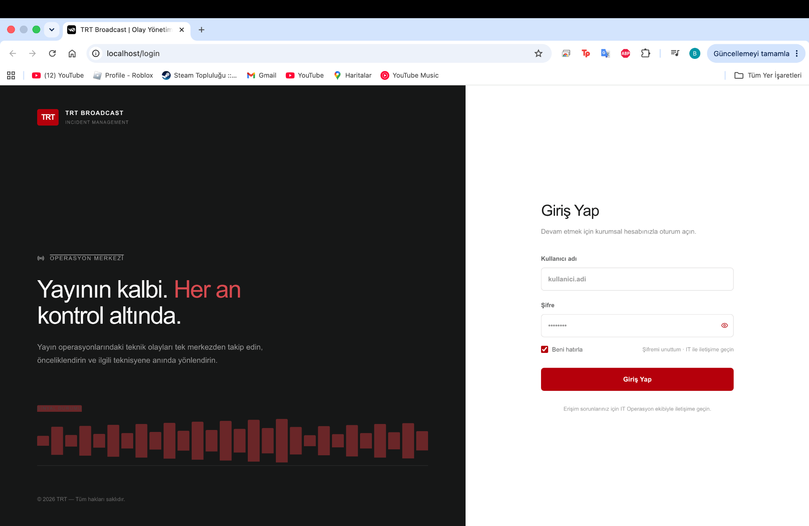
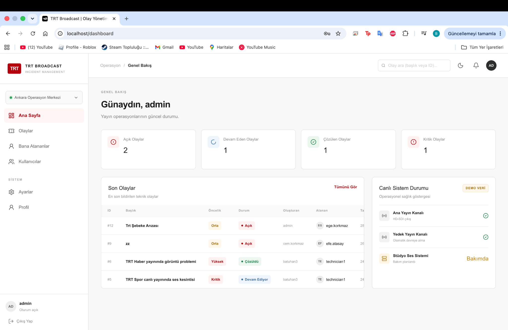
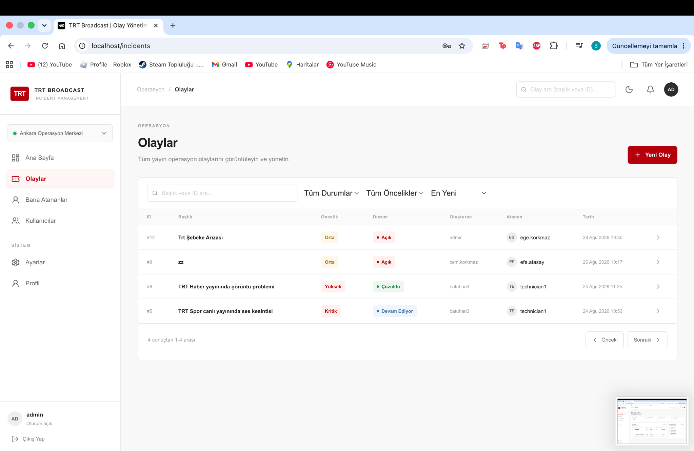
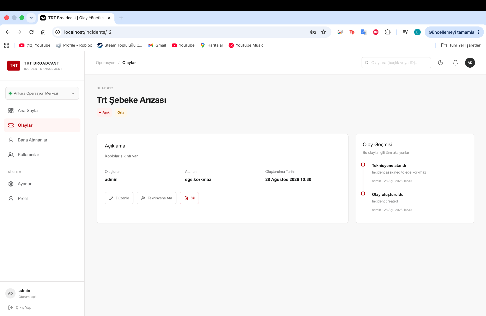
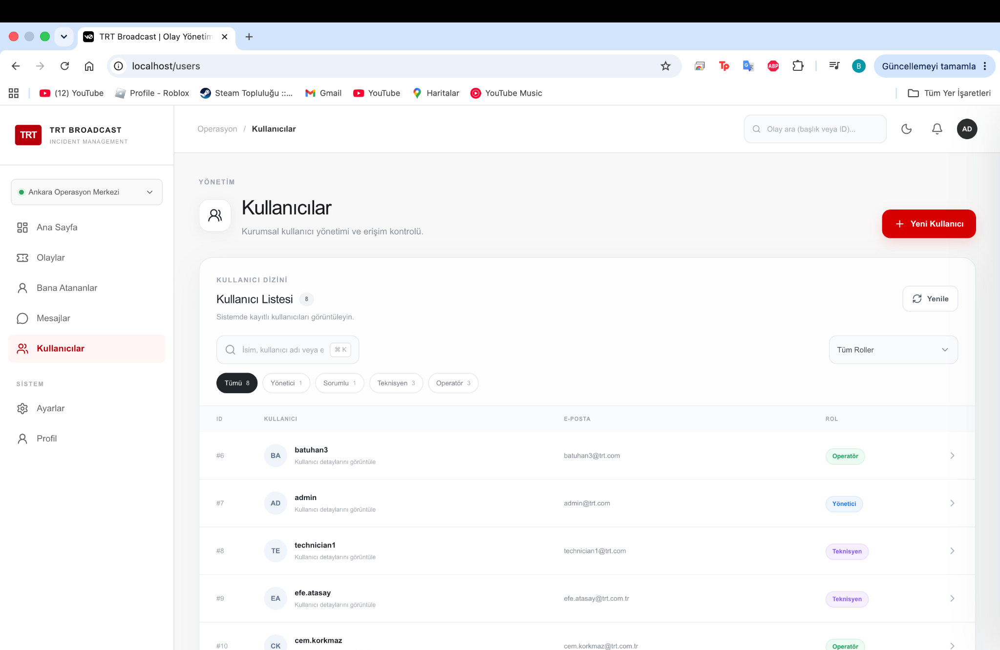
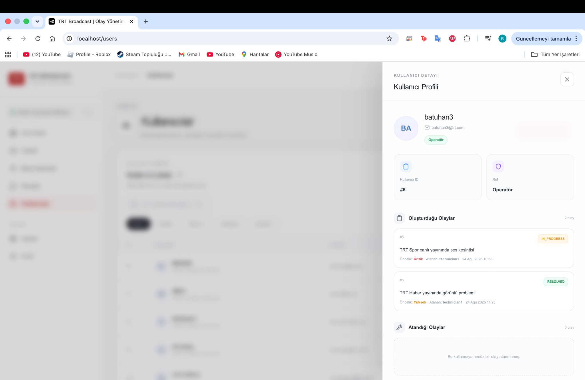
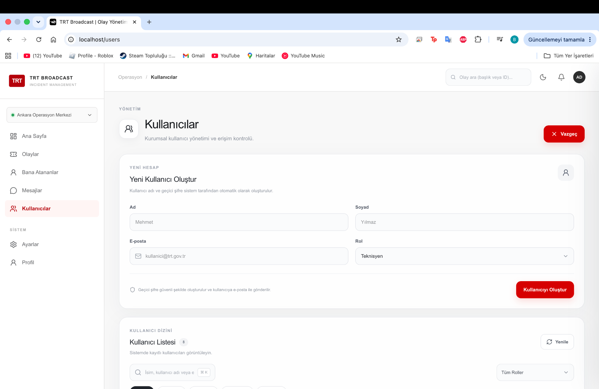
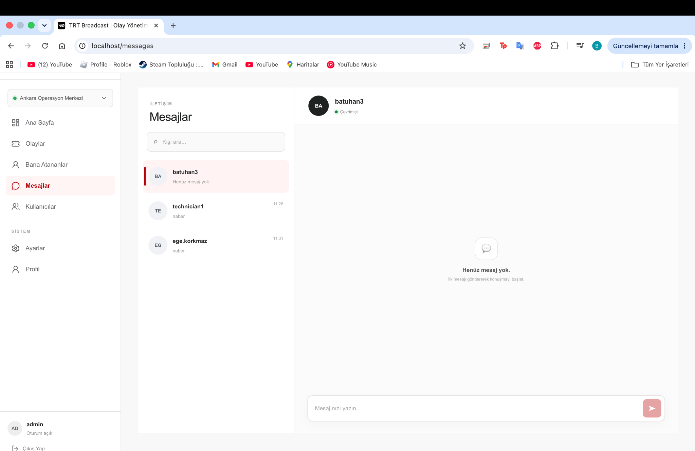
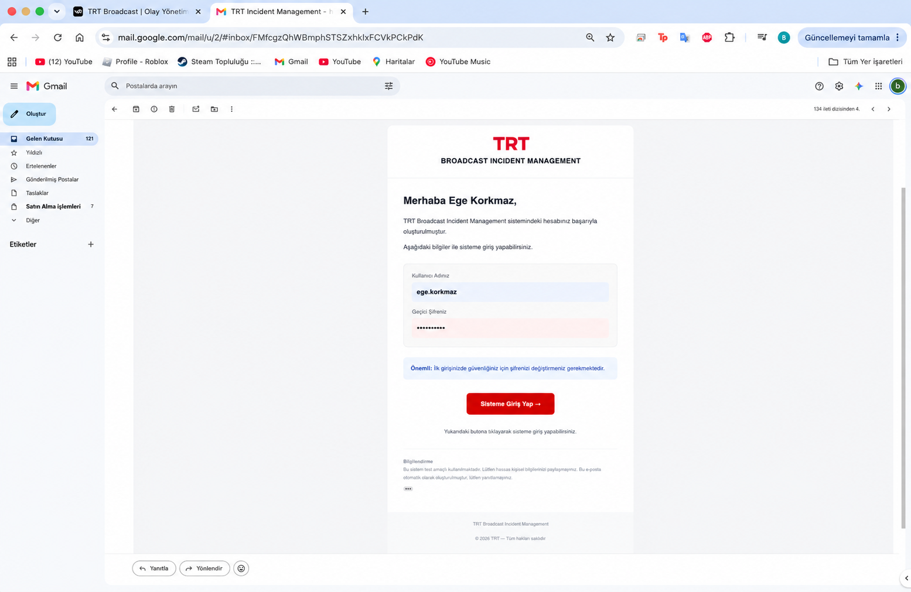

# 🚨 TRT Broadcast Incident Management

> Broadcast operasyonlarında meydana gelen teknik olayların merkezi olarak oluşturulması, takip edilmesi, ilgili teknik personele atanması ve ekipler arasındaki iletişimin yönetilmesi amacıyla geliştirilmiş full-stack Incident Management platformu.

---

## 📌 Proje Hakkında

**TRT Broadcast Incident Management**, yayın operasyonları sırasında meydana gelebilecek teknik problemlerin ve olayların merkezi bir sistem üzerinden yönetilmesini sağlayan web tabanlı bir uygulamadır.

Sistem; olayların oluşturulması ve takibinin yanı sıra olayların öncelik ve durum bilgilerinin yönetilmesini, teknik personele atanmasını, olay geçmişinin tutulmasını ve kullanıcılar arasında birebir mesajlaşmayı sağlar.

Uygulama; **Next.js**, **React**, **TypeScript**, **Spring Boot**, **Spring Security**, **JWT**, **PostgreSQL**, **Docker**, **Nginx** ve **AWS EC2** teknolojileri kullanılarak geliştirilmiştir.

---

## ✨ Özellikler

### 🚨 Olay Yönetimi

- Yeni olay oluşturma
- Olay detaylarını görüntüleme
- Olay durumunu güncelleme
- Olay önceliğini belirleme
- Olayları teknik personele atama
- Olay geçmişini görüntüleme
- Oluşturulan ve atanan olayları takip etme
- Olay yaşam döngüsünün durumlar üzerinden yönetilmesi

### 🎯 Öncelik Seviyeleri

| Öncelik | Açıklama |
|---|---|
| 🟢 LOW | Düşük öncelikli olay |
| 🟡 MEDIUM | Orta öncelikli olay |
| 🟠 HIGH | Yüksek öncelikli olay |
| 🔴 CRITICAL | Kritik olay |

### 🔄 Olay Durumları

```text
OPEN → IN_PROGRESS → RESOLVED → CLOSED
```

### 👥 Kullanıcı ve Rol Yönetimi

Sistemde dört farklı kullanıcı rolü bulunmaktadır:

| Rol | Açıklama |
|---|---|
| 👑 ADMIN | Kullanıcı ve sistem yönetimi |
| 🧑‍💼 SUPERVISOR | Olay yönetimi ve teknik personele atama |
| 🔧 TECHNICIAN | Kendisine atanan teknik olayların yönetimi |
| 📺 OPERATOR | Olay oluşturma ve takip |

Yetkilendirme, Role-Based Access Control (RBAC) yaklaşımıyla gerçekleştirilmektedir.

### 🔐 Authentication & Security

Backend tarafında Spring Security ve JWT (JSON Web Token) tabanlı authentication kullanılmaktadır.

Güvenlik özellikleri:

- JWT tabanlı authentication
- Role-Based Authorization
- BCrypt password hashing
- Yetkiye göre endpoint erişimi
- Geçici parola sistemi
- İlk girişte parola değiştirme zorunluluğu
- Parolaların API response içerisinde gösterilmemesi
- Korunan REST API endpoint'leri

Kullanıcı oluşturulduğunda sistem tarafından geçici bir parola oluşturulur ve kullanıcıya e-posta üzerinden gönderilir. İlk giriş sonrasında kullanıcıdan parolasını değiştirmesi istenir.

### 📧 E-Mail Notifications

Sistem, kullanıcı ve olay işlemleri için otomatik e-posta bildirimleri gönderebilmektedir.

**Kullanıcı oluşturma akışı:**

```text
ADMIN → Kullanıcı oluşturur → Geçici parola oluşturulur
      → Kullanıcıya e-posta gönderilir → İlk giriş
      → Parola değiştirme zorunluluğu
```

**Olay atama:** Bir olay teknik personele atandığında ilgili kullanıcıya e-posta bildirimi gönderilir.

E-posta içerisinde kullanılan uygulama adresi environment variable üzerinden yönetilmektedir.

### 💬 Birebir Mesajlaşma

Sistem, kullanıcılar arasında birebir mesajlaşma özelliğine sahiptir.

**Mesajlaşma yapısı:**

```text
Conversation
  ├── ConversationParticipant
  └── Message
```

**Özellikler:**

- Kullanıcı arama
- Birebir konuşma oluşturma
- Mesaj gönderme
- Konuşma geçmişini görüntüleme
- Gelen mesajların solda, gönderilen mesajların sağda gösterilmesi
- Responsive mesajlaşma arayüzü
- Mobil cihazlarda konuşma listesi ve chat ekranı arasında geçiş

---

## 📸 Screenshots

### 🔐 Login



### 🏠 Dashboard



### 🚨 Incident Management



### 🔍 Incident Details



### 👥 User Management



### 👤 User Details



### ➕ Create User



### 💬 One-to-One Messaging



### 📧 Email Notification



---

## 🖥️ Frontend

Frontend tarafı Next.js, React ve TypeScript kullanılarak geliştirilmiştir.

Arayüz içerisinde:

- Dashboard
- Incident Management
- Kullanıcı Yönetimi
- Bana Atananlar
- Mesajlaşma
- Responsive tasarım
- Mobil uyumlu sidebar
- Dark Mode
- Kullanıcı ve rol bazlı arayüz kontrolleri

bulunmaktadır.

**Frontend Teknolojileri:** Next.js · React · TypeScript · Tailwind CSS · CSS · Lucide React

---

## ⚙️ Backend

Backend, RESTful API mimarisi kullanılarak Spring Boot ile geliştirilmiştir.

**Backend Teknolojileri:** Java 17 · Spring Boot · Spring Security · JWT · Spring Data JPA · Hibernate · PostgreSQL · Maven · Lombok · Jakarta Mail

Backend; authentication, authorization, kullanıcı yönetimi, olay yönetimi, olay geçmişi, olay atama, mesajlaşma ve e-posta bildirimlerinden sorumludur.

---

## 🗄️ Database

Veri yönetimi için PostgreSQL 16 kullanılmaktadır.

**Temel entity yapısı:**

```text
User
 ├── Created Incidents
 └── Assigned Incidents

Incident
 ├── Created By
 ├── Assigned To
 └── Incident History

Conversation
 ├── Participants
 └── Messages
```

Veritabanı işlemleri Spring Data JPA ve Hibernate üzerinden gerçekleştirilmektedir.

---

## 🏗️ System Architecture

```text
                    ┌──────────────────┐
                    │      Browser     │
                    └────────┬─────────┘
                             │
                             ▼
                    ┌──────────────────┐
                    │       Nginx      │
                    │  Reverse Proxy   │
                    └────────┬─────────┘
                             │
              ┌──────────────┴──────────────┐
              │                             │
              ▼                             ▼
     ┌─────────────────┐           ┌─────────────────┐
     │     Next.js     │           │   Spring Boot   │
     │     Frontend    │           │     Backend     │
     │      :3000      │           │      :8080      │
     └─────────────────┘           └────────┬────────┘
                                            │
                                            ▼
                                     ┌─────────────────┐
                                     │   PostgreSQL    │
                                     │      :5432      │
                                     └─────────────────┘
```

---

## 🐳 Docker

Uygulama container-based mimariyle çalışmaktadır. Docker Compose içerisinde aşağıdaki servisler bulunmaktadır:

```text
┌────────────────────────────────────────────┐
│                  Docker                    │
│                                            │
│  ┌──────────┐  ┌──────────┐  ┌──────────┐  │
│  │ Frontend │  │ Backend  │  │ Postgres │  │
│  │  :3000   │  │  :8080   │  │  :5432   │  │
│  └──────────┘  └──────────┘  └──────────┘  │
│                                            │
│                 ┌─────────┐                │
│                 │  Nginx  │                │
│                 │   :80   │                │
│                 └─────────┘                │
└────────────────────────────────────────────┘
```

PostgreSQL verileri Docker volume üzerinde tutulmaktadır. Böylece backend ve frontend container'larının yeniden oluşturulması sırasında veritabanı verileri korunmaktadır.

---

## ☁️ AWS Deployment

Uygulama, AWS EC2 üzerinde Docker tabanlı olarak deploy edilmiştir.

**Production mimarisi:**

```text
                       AWS EC2
                          │
                          ▼
                   ┌─────────────┐
                   │    Nginx    │
                   │     :80     │
                   └──────┬──────┘
                          │
           ┌──────────────┴──────────────┐
           │                             │
           ▼                             ▼
    ┌──────────────┐             ┌──────────────┐
    │   Frontend   │             │   Backend    │
    │   Docker     │             │    Docker    │
    │    :3000     │             │     :8080    │
    └──────────────┘             └───────┬──────┘
                                         │
                                  ┌──────▼───────┐
                                  │  PostgreSQL  │
                                  │ Docker Volume│
                                  └──────────────┘
```

**Deployment Workflow:**

```text
Local Development → Git → GitHub → AWS EC2
  → Docker Build → Docker Compose → Production
```

---

## 🚀 Installation

### Gereksinimler

- Java 17
- Node.js 20+
- npm
- Docker
- Docker Compose
- Git

### Backend

```bash
cd broadcast-incident-management
./mvnw clean package -DskipTests
```

### Frontend

```bash
cd frontend
npm install
npm run build
```

---

## 🐳 Docker ile Çalıştırma

Proje root dizininde:

```bash
docker compose up -d --build
```

Container'ları görüntülemek için:

```bash
docker ps
```

Logları görüntülemek için:

```bash
docker compose logs -f
```

Uygulamayı durdurmak için:

```bash
docker compose down
```

> ⚠️ PostgreSQL verilerinin korunması için database volume'u silinmemelidir.

---

## 🔄 Production Deployment

AWS EC2 üzerinde güncel GitHub versiyonunu deploy etmek için:

```bash
git pull --rebase origin main
```

Backend image oluşturma:

```bash
docker build -t trt-backend:latest ./broadcast-incident-management
```

Frontend image oluşturma:

```bash
docker build -t trt-frontend:latest ./frontend
```

Backend ve frontend container'larını güncelleme:

```bash
docker compose up -d --no-deps --force-recreate backend frontend
```

Container durumlarını kontrol etme:

```bash
docker ps
```

---

## 🔌 API

REST API modülleri:

```text
/api/auth           → Authentication
/api/users          → User Management
/api/incidents      → Incident Management
/api/conversations  → Messaging
```

API dokümantasyonu için Swagger/OpenAPI desteği bulunmaktadır.

---

## 🔑 Environment Variables

Hassas bilgiler source code içerisinde tutulmaz.

Örnek environment değişkenleri:

```env
MAIL_USERNAME=your-email@gmail.com
MAIL_PASSWORD=your-app-password
APP_URL=http://localhost:3000
```

Production ortamında environment variable'lar deployment ortamından sağlanmaktadır.

> ⚠️ `.env` dosyaları repository'ye commit edilmemelidir.

---

## 📊 Tech Stack

| Alan | Teknoloji |
|---|---|
| Backend | Java 17 |
| Framework | Spring Boot |
| Security | Spring Security + JWT |
| ORM | Hibernate / JPA |
| Database | PostgreSQL 16 |
| Build Tool | Maven |
| Frontend | Next.js |
| UI | React |
| Language | TypeScript |
| Styling | Tailwind CSS / CSS |
| Icons | Lucide React |
| Email | Jakarta Mail / SMTP |
| Containerization | Docker |
| Orchestration | Docker Compose |
| Reverse Proxy | Nginx |
| Cloud | AWS EC2 |
| Version Control | Git / GitHub |

---

## 📁 Project Structure

```text
trt-staj/
│
├── broadcast-incident-management/
│   ├── src/
│   │   ├── main/
│   │   │   ├── java/
│   │   │   │   └── com/trt/broadcastincidentmanagement/
│   │   │   └── resources/
│   │   └── test/
│   │
│   ├── Dockerfile
│   ├── pom.xml
│   └── mvnw
│
├── frontend/
│   ├── app/
│   ├── components/
│   ├── hooks/
│   ├── lib/
│   ├── public/
│   ├── Dockerfile
│   └── package.json
│
├── nginx/
│   └── nginx.conf
│
├── docker-compose.yml
└── README.md
```

---

## 🎯 Projenin Amacı

Projenin temel amacı, broadcast operasyonlarında meydana gelen teknik olayların tek bir platform üzerinden yönetilmesini sağlamaktır.

Sistem sayesinde:

- Teknik olaylar merkezi olarak kaydedilebilir.
- Olaylar önem seviyelerine göre önceliklendirilebilir.
- Olayların mevcut durumları takip edilebilir.
- Olaylar ilgili teknik personele atanabilir.
- Olay geçmişi kayıt altında tutulabilir.
- Kullanıcıların sistem erişimleri rollerine göre sınırlandırılabilir.
- Kullanıcılar arasında birebir iletişim sağlanabilir.
- Kullanıcı ve olay atama işlemleri hakkında e-posta bildirimleri gönderilebilir.
- Uygulama Docker ve AWS EC2 üzerinde çalıştırılabilir.

---

## 👨‍💻 Developer

**Batuhan Efe Korkmaz**
Computer Engineering Student

Java · Spring Boot · Spring Security · JWT
PostgreSQL · JPA · Hibernate · Maven
Next.js · React · TypeScript
Docker · Docker Compose · Nginx
AWS EC2 · Git · GitHub

---

## 📄 License

This project was developed for educational and internship purposes.